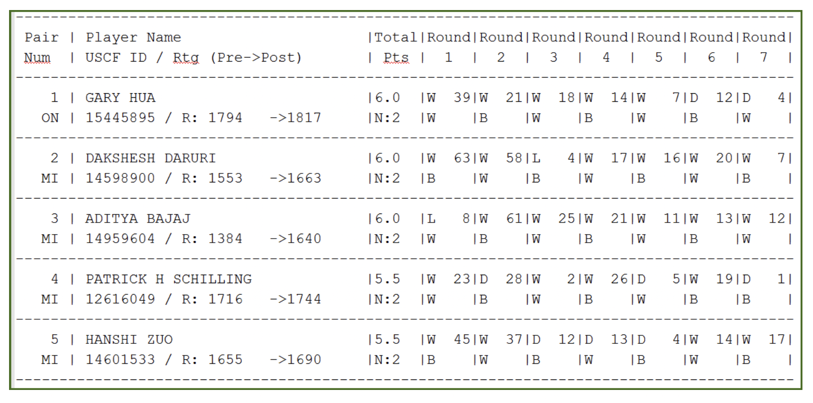

## Project Description

For this project, we're provided a text file with chess tournament results in a tabular format. Our task is to generate a .CSV file  with the following information for all of the players:

- Player’s Name
- Player’s State
- Total Number of Points
- Player’s Pre-Rating
- Average Pre Chess Rating of Opponents



## Data Loading & Transformations

To accomplish this task, we'll create three subtables; one of Player data, one of Match data, and a third table that counts how many matches each Player completed.

As we can see, our source data is not well-formatted (or 'tidy') with each row representing a single observation of player performance; instead, each player has information stored over two consecutive rows.  

This tabular format makes for a nice visual presentation, but it poses a challenge for processing and analysis. We'll take two different approaches to tidying this data - but first let's load it in using **read_delim** with the pipe character (|) as our separator.

```{r, message=FALSE, warning=FALSE}
library(tidyverse)
df <- read_delim('https://raw.githubusercontent.com/jefedigital/cuny-data-607-projects/main/chess-tournament/data/tournamentinfo.txt', 
                 delim='|', skip=2, trim_ws=TRUE, show_col_types = FALSE) %>% 
  rename(player_id=1, player_name=2)
  
df <- select(df,1:length(df)-1) # drop last col
```
```{r, echo=FALSE}
head(df)
```

### Players table

First, let's create a Player table with tournament id, name, state, and pre-tournament rating, so that each player's information is represented on a unique row.

First, we'll select the first two columns from **df**, and remove all the 'separator' rows (where player_name is NA.)
```{r}
# select first two cols, drop rows where player_id is NA 
df_players <- select(df,1:2) %>% 
  filter(!is.na(df['player_name'])) 
```

```{r echo=FALSE}
head(df_players)
```
Next we'll want to condense each two-row sequence to a single row; creating separate dataframes of even and odd rows, then binding them together column-wise.
```{r, message=FALSE, warning=FALSE}

# create two dfs from even and odd rows, bind column-wise and relabel
df_players_odd <- filter(df_players,row_number() %% 2 == 1)
df_players_even <- filter(df_players,row_number() %% 2 == 0)

df_players <- bind_cols(df_players_odd, df_players_even)
names(df_players) <- c('player_id','name','state','player_info')
```

```{r echo=FALSE}
head(df_players)
```
FInally, we'll use a regex to grab the player's pre-tournament rating from the middle of **player_info**.
```{r, message=FALSE, warning=FALSE}
# extract player pre-rating, convert player_id to numeric, drop player_info 
df_players <- df_players %>% 
  mutate(pre_rating = as.numeric(str_extract(player_info,'(?<=: ).{4}'))) %>% 
  mutate(player_id = as.numeric(player_id)) %>% 
  select(!player_info)
```

```{r echo=FALSE}
head(df_players)
```

### Matches table
Tidying up for our Matches table will be simpler; looking at our original **df**, the scores for each tournament round are contained in the rows where **player_id** is a number. We should be able to simply filter rows using **as.numeric**, but there's an extra step required! 

The **player_id** column is character type, and we didn't coerce it to numeric in the first step because we needed to retrieve the State and Pre-Rating values.  Instead, let's create an array with **as.numeric** and filter on the resulting NA values instead:

```{r, message=FALSE, warning=FALSE}
# only keep rows with a numeric value in first column
df_matches <- filter(df, !is.na(as.numeric(df$player_id))) 

# drop cols we don't need
df_matches <- select(df_matches,-player_name,-Pts)
```

```{r echo=FALSE}
head(df_matches)
```
Next, we'll use **pivot_longer** to pivot the data so that each row represents a single round's results from a single player:
```{r, message=FALSE, warning=FALSE}
# pivot all columns except player_id
df_matches <- pivot_longer(df_matches,!player_id, 
                           names_to='round', 
                           values_to='match_info') 
```

```{r echo=FALSE}
head(df_matches)
```
For brevity, the next code chunk accomplishes several tasks:

- Extract the **outcome** code (W,L,D...) and the **opponent_id** from **match_info**.
- Filter the rows on **outcome** so we only keep Wins, Losses and Draws.
- Create a **match_points** column which uses **ifelse** to award 1 point for a Win and .5 points for a Draw.
```{r, message=FALSE, warning=FALSE}
# separate match_info into outcome and opponent_id; filter for wins, losses 
# and draws; calculate points per match; convert to numeric; drop match_info.

df_matches <- df_matches %>% 
  mutate(outcome=str_sub(match_info,1,1), 
         opponent_id=str_sub(match_info,str_length(match_info)-1)) %>%
  filter(outcome == 'W' | outcome =='L' | outcome == 'D') %>% 
  mutate(match_points = ifelse(outcome == 'W', 1, ifelse(outcome == 'D', 0.5, 0))) %>% 
  mutate(player_id = as.numeric(player_id), 
         opponent_id = as.numeric(opponent_id)) %>%
  select(!match_info) # 
```

```{r echo=FALSE}
head(df_matches)
```

And as a final step, we'll join in the opponent's pre-tournament ratings from our new Players table.
```{r, message=FALSE, warning=FALSE}
# join in the opponent's pre-ratings; rename column
df_matches <- df_matches %>% 
  left_join(df_players[c('player_id','pre_rating')], 
            by = c('opponent_id' = 'player_id')) %>% 
  rename(opponent_pre_rating = pre_rating)
```

```{r echo=FALSE}
head(df_matches)
```

### Matches per Player table

For our third table, let's run a quick group_by on the Matches table and count the number of matches completed per player.
```{r, message=FALSE, warning=FALSE}
# calculate number of matches per player
df_matches_played <- df_matches %>%
  group_by(player_id) %>%
  summarize(matches_played = n())
```

```{r echo=FALSE}
head(df_matches_played)
```

### Final Scores and Opponent Ratings

With our Matches table, let's total up the match scores for each player, and get the average pre-rating of the opponents they each faced.
```{r, message=FALSE, warning=FALSE}
df_player_scores <- df_matches %>% 
  group_by(player_id) %>% 
  summarize(total_points=sum(match_points), 
            avg_opponent_pre_rating=round(mean(opponent_pre_rating))) %>%
  arrange(player_id)
```

```{r echo=FALSE}
head(df_player_scores)
```

## Results
Joining our player scores to our Players table gives us the final result. 
```{r}
df_final <- df_players %>% 
  left_join(df_player_scores, by='player_id') %>%
  left_join(df_matches_played, by='player_id') %>% 
  relocate(matches_played, .after=state) %>% 
  relocate(total_points, .after=matches_played) # rearrange column order

df_final_all_players <- df_final %>% 
  select(!matches_played)
```

```{r echo=FALSE}
head(df_final_all_players)
```

We can filter this using our Matches per Player table compare players who completed all seven rounds, to those who completed fewer than seven:
```{r}
df_final_all_matches <- df_final %>% 
  filter(matches_played == 7) %>%
  select(!matches_played)
```

```{r echo=FALSE}
str(df_final_all_matches)
```

```{r}
df_final_some_matches <- df_final %>%
  filter(matches_played < 7) %>%
  select(!matches_played)
```

```{r echo=FALSE}
str(df_final_some_matches)
```

## Output
```{r, message=FALSE, warning=FALSE}
write_csv(df_final_all_players, 'output/all_players.csv')
write_csv(df_final_all_matches, 'output/played_all_matches.csv')
write_csv(df_final_some_matches, 'output/played_some_matches.csv')
```


